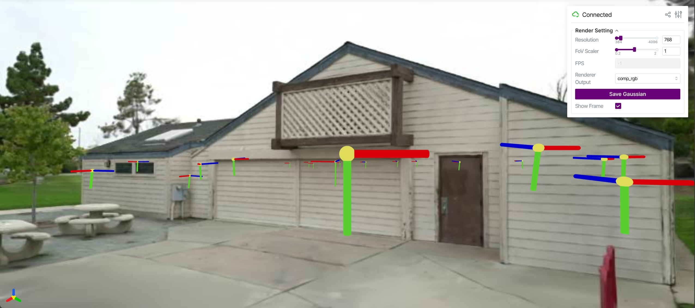

<div align="center">
<h1>3DGS-Viewer</h1>
    

</div>

## 😋Introduction
It is a simple 3DGS viewer based on viser. You can view a 3DGS model through a web browser without relying on a GUI.

## 🔨Installation
To install, you can use the following command:
```
pip install -r requirements.txt
pip install -e submodules/diff-gaussian-rasterization
pip install -e submodules/simple-knn
pip install -e submodules/fused-ssim
```

## ⚡Run
To use the viewer, you can use the following command:
```
python webui.py --gs_source "<YOUR PATH>" --colmap_dir "<YOUR PATH>"
```

## 😘Acknowledgements

This project is built upon [3D Gaussian Splatting](https://github.com/graphdeco-inria/gaussian-splatting) and [GaussianEditor](https://github.com/buaacyw/GaussianEditor). We want to thank the authors for their contributions.
